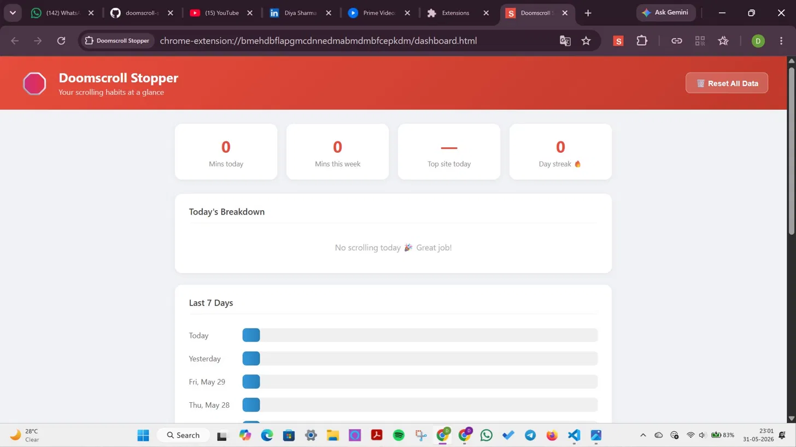
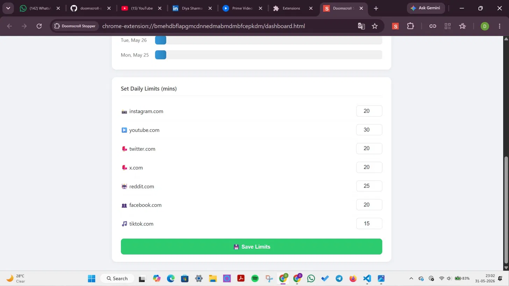

# 🛑 Doomscroll Stopper

> A Chrome extension that tracks and limits your doomscrolling habit

## 📸 Screenshots

### ⚠️ Break Reminder Overlay

### 📊 Dashboard

## ✨ Features
- 🕐 Tracks time spent on Instagram, YouTube, Twitter, Reddit, Facebook, TikTok
- 🛑 Warning overlay after 10 minutes of continuous scrolling
- 📊 Beautiful popup with today's usage per site
- 📈 Full dashboard with weekly stats and bar charts
- ⚙️ Set custom daily limits per website
- 🔔 Desktop notifications when limit exceeded
- 🔥 Daily streak tracker

## 🚀 Installation
1. Clone this repo
2. Open Chrome → `chrome://extensions/`
3. Enable **Developer mode**
4. Click **Load unpacked** → select this folder
5. Pin the 🛑 icon to your toolbar
6. Visit any social media site and start tracking!

## 🌐 Supported Sites
| Site | Default Limit |
|------|--------------|
| 📸 Instagram | 20 mins |
| ▶️ YouTube | 30 mins |
| 🐦 Twitter / X | 20 mins |
| 🤖 Reddit | 25 mins |
| 👥 Facebook | 20 mins |
| 🎵 TikTok | 15 mins |

## 🛠️ Tech Stack
- HTML, CSS, JavaScript
- Chrome Extensions API (Manifest V3)
- Chrome Storage API
- Chrome Notifications API

## 🤝 Contributing
Pull requests are welcome! Feel free to open an issue for bugs or feature requests.

## 📄 License
MIT
